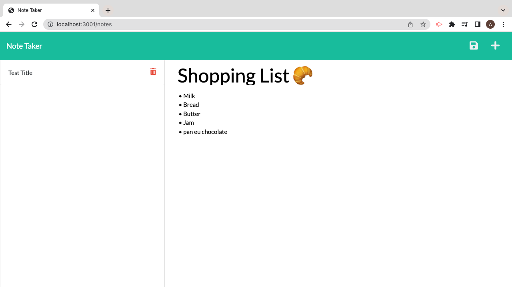
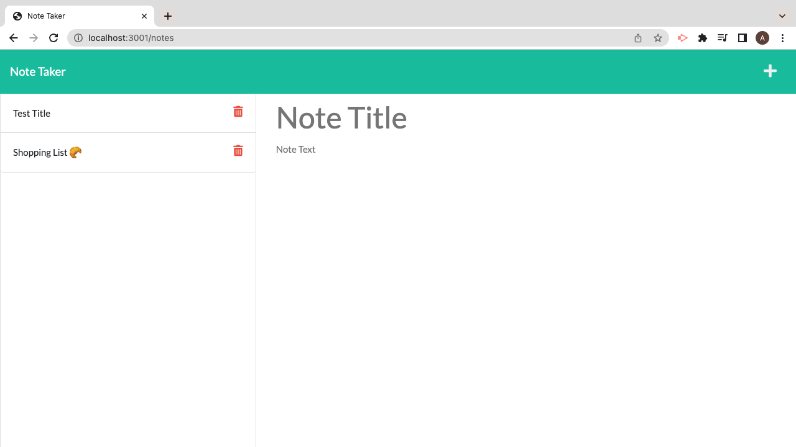

# week-11-Note-Taker

Customer asked for a page that allows them to take notes, save them and delete them.
## User Story

- As a developer I want a page that is interactive using Java Script to allow users to save notes and delete them interacting from front end to back end using api routes.

- So that the user is able to render the page and see all previously saved notes 

## Acceptance Criteria

- GIVEN page that is interactive with the user to be able to save notes

- WHEN JS elements are understood across search engines to allow for interaction 

- WHEN a user presses onto the save button, they can set a saved note

- WHEN a user is able to see saved notes

- WHEN a user reloads the page, they are able to see previously saved notes 

- WHEN page allows for smooth navigation from the user

- WHEN the pages JS, CSS and HMTL link up accordingly with the page

 
 

My main issue was getting the delete  button to work. As each time the button was pressed the page would let me see interactivity in the console however the delete function would not work each time  the page was rendered.

 

## General info
This is a page developed through javascript, HTML and later styled through CSS. The main functionality of the page comes from Java Script which allows for the interactivity by the user to be able to go into the page to save and delete notes. The user is presented with a page containing a show of the notes they have made. The user can actively add notes to their list to track and delete them when they are no longer necessary. I built the back end to the front end, connect the two, and finally deployed it using Heroku.

## Page link

https://adiba-note-taker.herokuapp.com/

## MY WEB PAGE
button to open application is presented to the user

User is able to make a note on the system

User is also able save the note on the system and note can be seen once the page is rendered again

User is able to delete the note
